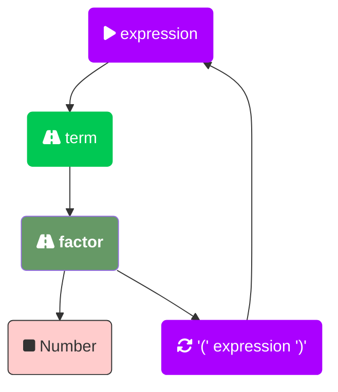
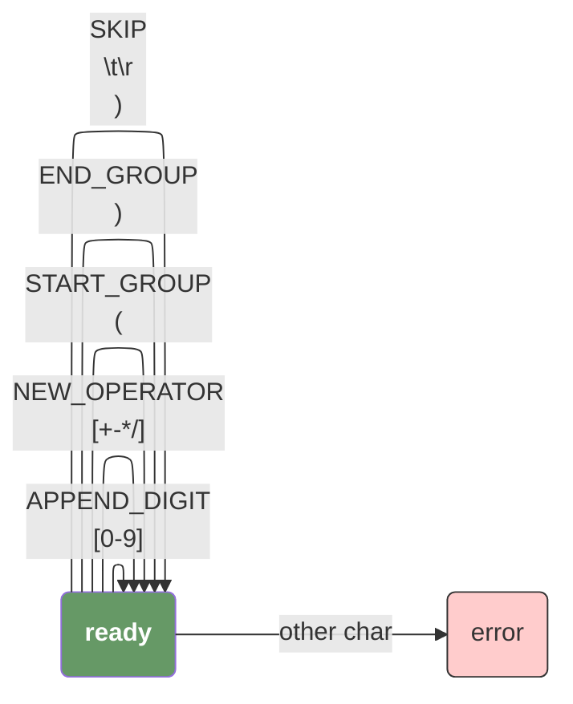
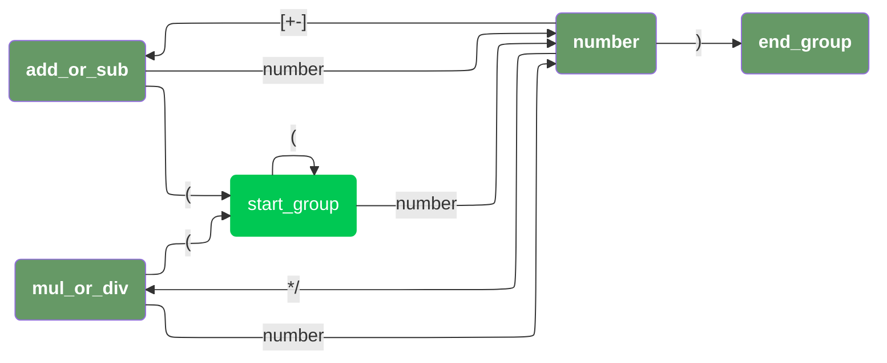

# test-fsm-arithmetic-operations

>测试一下通过 [Finite State Machine](https://en.wikipedia.org/wiki/Finite-state_machine) 实现简单的四则运算解析

在之前 [Programming Language Monkey](https://github.com/0x822a5b87/monkey) 中，其实也实现了一版，但是当时只是简单的根据 [Pratt Parsing](https://github.com/0x822a5b87/test-pratt-parsing) 实现，并没有画出完整的状态机，所以在这里重新实现了一次，为了避免浪费太多的时间，这次将只会支持以下简单内容：

- 支持 `+`, `-`, `*`, `/` 四则运算；
- 支持 `()`；
- 仅支持标准十进制格式的 number，不支持 `0xFF` 等其他形式的数字输入；
- 仅支持 `int64` 类型，也就是说除法会导致会导致数据丢失，但是考虑到本来就是为了了解状态机而实现的玩具，这个完全是可以接受的；

## 前言

什么是状态机？简而言之就是，一个物体存在一个状态，在接收一个外部事件之后，跳转到另外一个状态的过程。例如，一个饥饿的人吃饱饭，我们可以使用如下的状态机描述他的状态转换过程：


## BNF

在实现我们的四则运算之前，我们可以先通过一个简单的 `BNF` 定义他的文法，我们直接基于 `antlr4` 实现，这里用到了两个在编写语法规则中非常有用的技巧：

1. 消除左递归；
2. 优先级控制；

```antlr4
grammar Arithmetic;

expression: term 
    | expression '+' term
    | expression '-' term
    ;

term: factor 
    | term '*' factor
    | term '/' factor
    ;

factor: NUMBER | '(' expression ')';

NUMBER: [0-9]+;
WS: [ \t\r\n]+ -> skip;
```


### 消除左递归

消除左递归：在语法规则中，如果存在左递归，会导致无限循环的解析过程。为了消除左递归，可以通过将左递归的规则拆分成多个规则，并使用递归调用来实现。在四则运算的语法规则中。例如，通过将 expression 定义为一个 term 或者一个 expression 加上一个 term，就消除了左递归。

### 优先级控制

在语法规则中，不同的运算符可能有不同的优先级。为了正确处理运算符的优先级，我们可以通过这样的方式来方便的实现有限级控制：

1. 按照从低到高的顺序在语法规则中定义不同的规则；
2. 在优先级较低的语法规则中递归调用优先级比他高一级的规则；
3. 在递归的最后，我们可能会碰到终结符，或者再次通过类似于 `()` 的形式创建一个新的 ParseGroup 来递归的解析；

这样，解析器在解析表达式时会先处理优先级较低的运算符，然后再处理优先级较高的运算符。在四则运算的语法规则中，先定义了 term，然后再定义了 expression，这样就可以保证乘法和除法的优先级高于加法和减法。



## 状态机

一个确定有限状态自动机通常会包含以下四个重要的概念：

- `state` 当前FSM状态；
- `event` 事件；
- `transition` 标志了FSM的状态从 A 到 B 的转换；
- `action` 与每次状态关联的转换操作，最常用的有 `enter` 表示进入状态，`exit` 表示退出某个状态。

而在我们的解析过程中，我们实际会分成两个步骤对输入字符串进行转换：

1. 输入 char，转换为 token；
2. 输入 token，转换为 AST；

而在这个过程中，其实我们应该是存在两个不同的状态机。


### tokenizer



### parser



## 参考

- [What Is a Finite State Machine (FSM)? Meaning, Working, and Examples](https://www.spiceworks.com/tech/tech-general/articles/what-is-fsm/)

